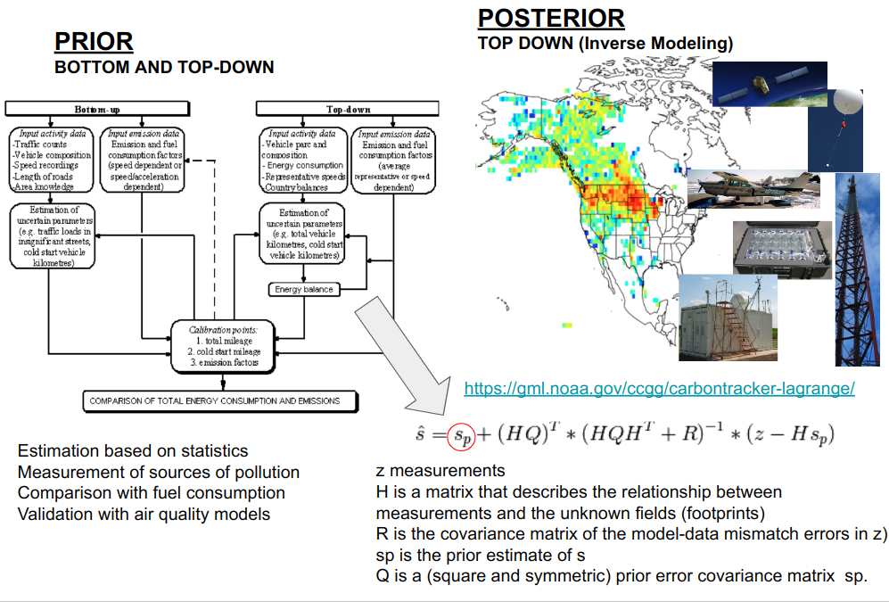
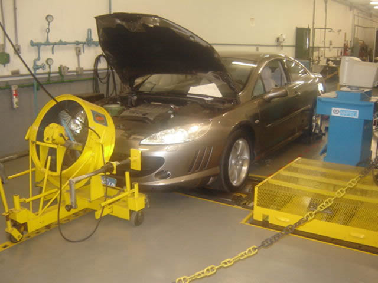
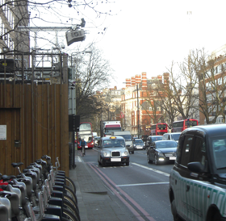
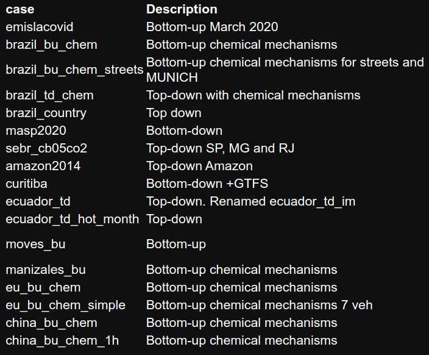
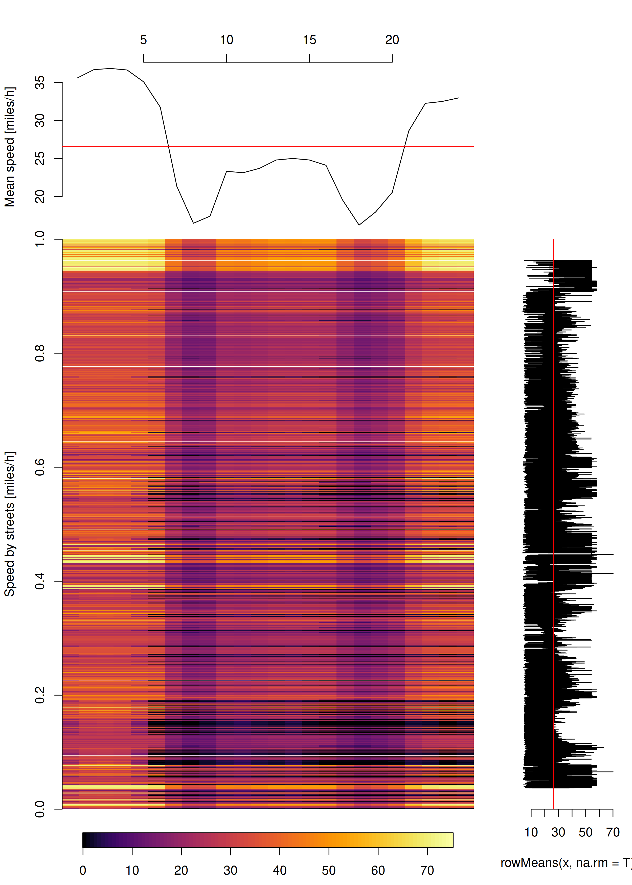
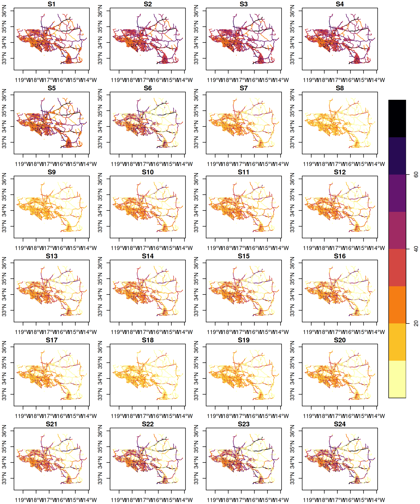
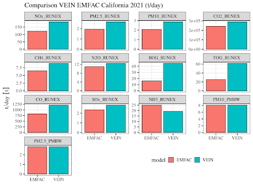
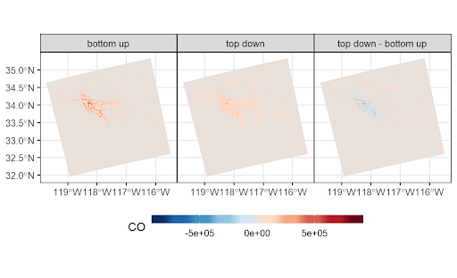

```{r setup, include=FALSE}
options(htmltools.dir.version = FALSE)
knitr::opts_chunk$set(
  fig.width=9, 
  fig.height=3.5, 
  fig.retina=3,
  out.width = "100%",
  cache = FALSE,
  echo = TRUE,
  message = FALSE, 
  warning = FALSE,
  hiline = TRUE
)
```

```{r xaringan-themer, include=FALSE, warning=FALSE}
library(xaringanthemer)
style_duo_accent_inverse(primary_color = "#006747", 
                         secondary_color = "#cfc493")
library(ggplot2)
library(sf)
library(vein)
library(data.table)
library(gtfs2gps)
```

## vein


---
## Emisiones vehiculares

- Las [emisiones vehiculares](https://en.wikipedia.org/wiki/Exhaust_gas) son los contaminantes emitidos por los vehiculos.
- Es la **masa** de contaminantes emitida por los vehiculos.

.pull-left[
.center[
]
]

.pull-right[
.center[


]
]


---
## Emisiones vehiculares



---
## Que son las emisiones vehiculares?

- Emisiones de tubo de escape.
  - **Tubo de escape**. Emisiones con temperatura de motor y dispositivos de operacion.
  - **Partidas en frio**. Emisiones con temperatura menor a temperatur optima motor y dispositivos
- **[Evaporativas](https://www.eea.europa.eu/publications/emep-eea-guidebook-2019/part-b-sectoral-guidance-chapters/1-energy/1-a-combustion/1-a-3-b-v/view)**
  - **Evaporativas hot-soak**: [hidrocarburos evaporados](https://nepis.epa.gov/Exe/ZyNET.exe/P1001DHA.txt?ZyActionD=ZyDocument&Client=EPA&Index=1995%20Thru%201999&Docs=&Query=&Time=&EndTime=&SearchMethod=1&TocRestrict=n&Toc=&TocEntry=&QField=&QFieldYear=&QFieldMonth=&QFieldDay=&UseQField=&IntQFieldOp=0&ExtQFieldOp=0&XmlQuery=&File=D%3A%5CZYFILES%5CINDEX%20DATA%5C95THRU99%5CTXT%5C00000021%5CP1001DHA.txt&User=ANONYMOUS&Password=anonymous&SortMethod=h%7C-&MaximumDocuments=1&FuzzyDegree=0&ImageQuality=r75g8/r75g8/x150y150g16/i425&Display=hpfr&DefSeekPage=x&SearchBack=ZyActionL&Back=ZyActionS&BackDesc=Results%20page&MaximumPages=1&ZyEntry=12#) del vehiculo detenido, despues de parar el motor.
  - **Evaporativas running losses**: son los [hidrocarburos evaporados emitidos](https://nepis.epa.gov/Exe/ZyNET.exe/P1001DHA.txt?ZyActionD=ZyDocument&Client=EPA&Index=1995%20Thru%201999&Docs=&Query=&Time=&EndTime=&SearchMethod=1&TocRestrict=n&Toc=&TocEntry=&QField=&QFieldYear=&QFieldMonth=&QFieldDay=&UseQField=&IntQFieldOp=0&ExtQFieldOp=0&XmlQuery=&File=D%3A%5CZYFILES%5CINDEX%20DATA%5C95THRU99%5CTXT%5C00000021%5CP1001DHA.txt&User=ANONYMOUS&Password=anonymous&SortMethod=h%7C-&MaximumDocuments=1&FuzzyDegree=0&ImageQuality=r75g8/r75g8/x150y150g16/i425&Display=hpfr&DefSeekPage=x&SearchBack=ZyActionL&Back=ZyActionS&BackDesc=Results%20page&MaximumPages=1&ZyEntry=12#) con el vehiculo en movimiento.
  - **Evaporativas diurnal**: evaporacion diaria de [hidrocarburos](https://nepis.epa.gov/Exe/ZyNET.exe/P10021Q4.TXT?ZyActionD=ZyDocument&Client=EPA&Index=2000+Thru+2005&Docs=&Query=&Time=&EndTime=&SearchMethod=1&TocRestrict=n&Toc=&TocEntry=&QField=&QFieldYear=&QFieldMonth=&QFieldDay=&IntQFieldOp=0&ExtQFieldOp=0&XmlQuery=&File=D%3A%5Czyfiles%5CIndex%20Data%5C00thru05%5CTxt%5C00000017%5CP10021Q4.txt&User=ANONYMOUS&Password=anonymous&SortMethod=h%7C-&MaximumDocuments=1&FuzzyDegree=0&ImageQuality=r75g8/r75g8/x150y150g16/i425&Display=hpfr&DefSeekPage=x&SearchBack=ZyActionL&Back=ZyActionS&BackDesc=Results%20page&MaximumPages=1&ZyEntry=1&SeekPage=x&ZyPURL#) por variacion de temperatura  
- Otras
  - **Frenos y neumaticos**: [desgaste de frenos y neumaticos](https://www.eea.europa.eu/publications/emep-eea-guidebook-2019/part-b-sectoral-guidance-chapters/1-energy/1-a-combustion/1-a-3-b-vi/view)
  - **Resuspension**: Emisiones cuando el material suspendido en las calles es [re-suspendido](https://www.epa.gov/air-emissions-factors-and-quantification/ap-42-fifth-edition-volume-i-chapter-13-miscellaneous-0) debido al paso de los vehiculos.


---
## Como calcular las emisiones vehiculares?

$Emision_{contaminante}=\sum_{actividad}(NA_{actividad}*FE_{contaminante,actividad})$ (Pulles and Heslinga, 2010).

Para calcular las emisiones debemos multiplicar el nivel de actividad por el factor de emision!

_simple?_

.pull-left[
### Nivel de actividad
- Numero de vehiculos (veh)
- Distancia que recorren los vehiculos (km)

]

.pull-right[
### Factor de emision
- Masa de contaminante emitido por actividad.
- Por ejemplo, masa de contaminante por kilometro recorrido (g/km)
]

Luego

$E(g)=NA(km)*FE(g/km)$

- Por ejemplo, si un vehiculo recorre un kilometro, y el factor de emision es de 1 g CO/km, 
entones, el vehiculo emite 1 g CO.

---
## Aproximacion

.pull-left[
### Top-down (geometria: poligono)
- Numero total de vehiculos por tipo en _area_ de estudio.
- Numero total de vehiculos por tipo _en circulacion_.
- Numero medio anual de quilometros recorridos por tipo de vehiculo.
- Velocidad representativa de area de estudio.
- Consumo de combustible en area de estudio.
]

.pull-right[
### bottom-up (geometrias: lineas o puntos)
- _Flujo_ vehicular en las calles.
- vehiculos individuales (GPS, GTFS).
- Inteligencia artificial OCVR para detectar vehiculos.
- Deteccion de placas vehiculares con OCR (Optical Character Recognition).
- Consumo de combustible en area de estudio.
]

> **El consumo de combustible estimado debe ser igual al consumo de combustible registrado**


---
class: inverse center middle

# Datos de nivel de actividad

---
#  Datos de actividad vehicular

.pull-left[
```{r, fig.width=6, fig.height=4}
library(vein)
data("net")
plot(net["ldv"],  main ="Flujo leves Sao Paulo, Brazil [veh/h]", axes = T, pal = cptcity::cpt(colorRampPalette = T, rev = T))
```

]

.pull-right[
```{r, fig.width=5, fig.height=3}
library(gtfs2gps)
poa <- read_gtfs(system.file("extdata/poa.zip", package="gtfs2gps"))
subset <- gps_as_sfpoints(gtfs2gps(filter_single_trip(filter_single_trip(poa))))
plot(subset["trip_id"],  main ="GTFS Porto Alegre, Brazil", axes = T, key.pos = 2)

```

]

---
#  Datos de actividad vehicular

.pull-left[
```{r, fig.width=6, fig.height=4}
df <- st_transform(rbind(readRDS("maryland_1_5000.rds"), readRDS("maryland_5000_end.rds")), 4326)
plot(df["CAR_AADT"],  main ="Conteo vehicular Leves, Maryland, US [veh/year]", axes = T, pal = cptcity::cpt(colorRampPalette = T, rev = T))
```

]

.pull-right[
```{r, fig.width=6, fig.height=4}
a <- trapos::clean("https://raw.githubusercontent.com/ibarraespinosa/trapos/master/data-raw/dados/000000000000.csv")
plot(a["speed"],  main ="GPS vehiculos Sao Paulo, Brazil [veh]", axes = T)

```
]

---
## Como hacer conteo vehicular???

<video controls>
<source src="paulista2019.mp4" type="video/mp4">
Your browser does not support the video tag.
</video>    

---
class: inverse center middle

# Factores de emision

---
## Factores de emision

- Los factores de emision representan cantidad de contaminante emitido por la actividad vehicular.
- O sea, los factores de emision dependen de la actividad vehicular.
- Existen factores de emision que dependen de la velocidad media por hora, velocidad inastantanea por segundo,
aceleracion, nivel de congestion, situacion de trafico, cantidad de combustible, etc.
- Los factores de emision, tambien pueden ser medidos con diferentes tecnicas
- Medidos en laboratorios
- Medidos en tuneles
- Medidos tiempo real con [PEMS](https://pemschile.usm.cl/)

---
## Mediciones de laboratorio
[CETESB](https://cetesb.sp.gov.br/veicular/)

.center[

]

---
## Mediciones de tunel

[Evolution of Vehicle Emission Factors in a Megacity Affected by Extensive Biofuel Use: Results of Tunnel Measurements in São Paulo, Brazil](https://pubs.acs.org/doi/abs/10.1021/acs.est.1c01006)
.center[


]


---
## Sensoriamento remoto

.center[

]


Karl Ropkins1*; Timothy H. DeFries2; Francis Pope3; 
David C. Green4; Jim Kemper5; Sandeep Kishan2; 
Gary W. Fuller4; Hu Li6; Jim Sidebottom5,7; J. Stewart Hager7
27th CRC REAL WORLD EMISSIONS WORKSHOP
Long Beach, California, March 26-29, 2017


---
class: inverse center middle


---
## vein

.pull-left[
- **vein** es una libreria de R con subrutinas en Fortran
- Fortran incluye OpenMP para estimar emisiones con procesos paralelos
- importa **sf** con bindings GEOS, GDAL, PROJ y UDUNITS (muy rapido).
- importa **data.table** rapidisimo para procesar datos 🤯!
- aplica data-science espacial
- Publicado en GMD:
  - Ibarra-Espinosa, S., Ynoue, R., O'Sullivan, S., Pebesma, E., Andrade, M. D. F., and Osses, M.: VEIN v0.2.2: an R package for bottom–up vehicular emissions inventories, Geosci. Model Dev., 11, 2209–2229, https://doi.org/10.5194/gmd-11-2209-2018, 2018.
]


.pull-right[
- Procesos:
  - Procesa datos de actividad vehicular (bottom-up **o** top-down)
  - Selecciona factores de emision de Brazil, Estados Unidos, Europa o China.
  - Estima emisiones en cada hora y calle, para cada tipo de vehiculo.
  - Procesa las emisiones en bases de datos, calles y grillas.
  - Especia los contaminantes en compuestos especificos
  - Agrupo los compuestos en mas de 15 mecanismos quimicos
  - Generadots NetCDF para correr WRF/Chem
]


---
# vein: geometria de calles

```{r}
library(vein)
library(sf)
data(net)
net
```


---
# vein: geometria de calles

```{r, include = F}
nr <- classInt::classIntervals(var = net$ffs, n = 10, style = "quantile")
```

.pull-left[
```{r, fig.width=6, fig.height=4}
plot(net["ffs"],  main ="Velocidad flujo libre [km/h]", axes = T, pal = cptcity::cpt(colorRampPalette = T, rev = T), breaks = as.numeric(nr$brks))
```

]

.pull-right[
```{r, fig.width=6, fig.height=4}
plot(net["ps"],  main ="Velocidad de hora punta [km/h]", axes = T, pal = cptcity::cpt(colorRampPalette = T, rev = T),
     breaks = as.numeric(nr$brks))
```
]

---
# Vehiculos 

.pull-left[
```{r, fig.width=4, fig.height=8}
PC_E25_1400 <- age_ldv(x = net$ldv, name = "PC_E25_1400")
plot(PC_E25_1400,  main ="Vehiculos Gasolina por edad Sao Paulo [veh/h]")
```

]

.pull-right[
```{r, fig.width=6, fig.height=4}
PC_E25_1400 <- age_ldv(x = net$ldv, name = "PC_E25_1400", net = net)
plot(PC_E25_1400["PC_E25_1400_1"],  main ="Vehiculos nuevos Sao Paulo [veh/h]", axes = T, pal = cptcity::cpt(colorRampPalette = T, rev = T))
```
]

---
# Factores de expansion y velocidad


.pull-left[
```{r, fig.width=6, fig.height=4}
data("pc_profile")
names(pc_profile) <- c("Lunes", "Martes", "Miercoles", "Jueves", "Viernes", "Sabado", "Domingo")
colplot(pc_profile, main = "Perfiles temporales")
```

]

.pull-right[
```{r, fig.width=6, fig.height=4}
pc_week <- temp_fact(net$ldv+net$hdv, pc_profile)
dfspeed <- netspeed(pc_week, net$ps, net$ffs, net$capacity, net$lkm, alpha = 1.5,net = net)
plot(dfspeed["S1"],  main ="Velocidad 00:00 Sao Paulo [km/h]", axes = T, pal = cptcity::cpt(colorRampPalette = T, rev = T))
```
]

---
## Factores de emision


.pull-left[
```{r, fig.width=6, fig.height=4}
V <- 0:150
ef1 <- ef_ldv_speed(
  v = "PC",
  t = "4S", 
  cc = "<=1400", 
  f = "G",
  eu = "PRE",
  p = "CO", 
  speed = Speed(V))
ef2 <- unlist(lapply(seq_along(V), 
                     function(i){
                       ef_china(
                         t = "Small", 
                         f = "G", 
                         standard = "PRE", 
                         p = "CO", 
                         speed = Speed(i))}))
```

]

.pull-right[
```{r, fig.width=6, fig.height=4}
colplot(data.frame(Europe = ef1, China = ef2), 
        main = "Factores de emision de Europa y China Pre-Euro (g/km)")
```
]

---
## Estimacion de emisiones


```{r, fig.width=6, fig.height=4}
euro <- c(rep("V", 5), rep("IV", 5), rep("III", 5), rep("II", 5),
          rep("I", 5), rep("PRE", 15))
lef <- lapply(1:40, function(i) {
ef_ldv_speed(v = "PC", t = "4S", cc = "<=1400", f = "G",
          eu = euro[i], p = "CO", show.equation = FALSE) })
E_CO <- emis(veh = PC_E25_1400, lkm = net$lkm, ef = lef, speed = st_set_geometry(dfspeed, NULL),
             profile = pc_profile)
print(E_CO)
```


---
## Post-procesamiento

```{r, fig.width=6, fig.height=4}
E_CO_DF <- emis_post(arra = E_CO,  veh = "PC", size = "<1400", fuel = "G",
pollutant = "CO", by = "veh")
head(E_CO_DF, 1)
```

.pull-left[

```{r, fig.width=5, fig.height=3}
as.data.table(E_CO_DF)[, sum(g), by = hour][, barplot(t(V1), xlab = "horas")]
```
]

.pull-right[

```{r, fig.width=5, fig.height=3}
as.data.table(E_CO_DF)[, sum(g), by = age][, barplot(t(V1), xlab = "edad")]
```

]

---
## Post-procesamiento


```{r, fig.width=5, fig.height=3}
E_CO_STREETS <- emis_post(arra = E_CO, pollutant = "CO", by = "streets", net = net)
```

.pull-left[
```{r, fig.width=6, fig.height=4}
plot(E_CO_STREETS["V8"],  main ="Emisiones CO 00:00 Sao Paulo [g/h]", axes = T, pal = cptcity::cpt(colorRampPalette = T, rev = T))
```

]

.pull-right[
```{r, fig.width=6, fig.height=4}
plot(E_CO_STREETS["V19"],  main ="Emisiones CO 18:00 Sao Paulo [g/h]", axes = T, pal = cptcity::cpt(colorRampPalette = T, rev = T))
```

]


---
## Grillas de emisiones

.pull-left[
### 1000 m
```{r, fig.width=6, fig.height=4}
g1000 <- make_grid(net, 1/102.47)
E_CO_g1000 <- emis_grid(spobj = E_CO_STREETS, g = g1000, sr= 31983)
na <- paste0("V", 1:168)
for(i in 1:168) E_CO_g1000[[na[i]]] <- E_CO_g1000[[na[i]]] * units::set_units(1, "1/h")
```

]

.pull-right[
### 500 m
```{r, fig.width=6, fig.height=4}
g500 <- make_grid(net, 1/102.47/2)
E_CO_g500 <- emis_grid(spobj = E_CO_STREETS, g = g500, sr= 31983)
na <- paste0("V", 1:168)
for(i in 1:168) E_CO_g500[[na[i]]] <- E_CO_g500[[na[i]]] * units::set_units(1, "1/h")
```
]

---
## Fluxo superficial de emisiones

> Porque la diferencia si es la misma masa?

.pull-left[
```{r, fig.width=6, fig.height=4}
ggplot(E_CO_g1000) + geom_sf(aes(fill = as.numeric(V1)), lty = 0) +   scale_fill_gradientn("g/km2/h", colours = cptcity::cpt())+  xaringanthemer::theme_xaringan()
```

]

.pull-right[
```{r, fig.width=6, fig.height=4}
ggplot(E_CO_g500) + geom_sf(aes(fill = as.numeric(V1)), lty = 0) +   scale_fill_gradientn("g/km2/h", colours = cptcity::cpt())+  xaringanthemer::theme_xaringan()
```
]

---
## Creando WRF/Chem

```{r, eval = FALSE}
library(eixport)
gwrf   <- eixport::wrf_grid("wrfinput_d01")
dir.create(file.path(tempdir(), "EMISS"))
wrf_create(wrfinput_dir         = system.file("extdata", package = "eixport"),
           wrfchemi_dir         = file.path(tempdir(), "EMISS"),
           domains              = 2,
           frames_per_auxinput5 = 1, #hours
           auxinput5_interval_m = 60,
           verbose              = TRUE)
path_to_wrfi <- paste0(system.file("extdata", package = "eixport"), "/wrfinput_d02")
path_to_wrfc <- list.files(file.path(tempdir(), "EMISS"), full.names = TRUE)[1]
gwrf <- eixport::wrf_grid(path_to_wrfi)
E_CO_gwrf <- emis_grid(spobj = E_CO_STREETS, g = gwrf)
gr <- GriddedEmissionsArray(E_CO_gwrf, rows = 51, cols = 63, times = 1)
eixport::wrf_put(file = path_to_wrfc, name = "E_CO", POL = gr)

```


---
class: inverse center middle
### Complicado....
# Cierto?


---
# Por eso cree los proyectos

- Los [proyectos](https://github.com/atmoschem/vein#1-get-a-project-easier) fueron desarrollados para las personas que **NO SABEN NADA DE R**
- Por lo menos tienen ue saber **Excel**!

.pull-left[
- Que es un proyecto de vein?
  - Proyectos para bajar y correr
  - Permiten correr un inventario completo
  - incluyen todos los tipos de vehiculos
  - incluye plots de diagnostico, evaluacion y generacion de archivos de emisiones para WRF-Chem 
  - Permiten escoger muchos mecanismos quimicos
]

.pull-right[
- Que archivos son necesarios?
  - inventory.xlsx
  - net.gpkg (puede ser cualquer nombre o formato geoespacial permitido por GDAL)
- Que librerias son necesarias?
  - vein, ggplot2, sf, data.table, readxl, eixport
]

---
## Como correr un proyecto?

.pull-left[
```{r, eval = FALSE}
get_project(
  directory = "nueva_carpeta", 
  case = "masp2020"
)
setwd("nueva_carpeta")
source("main.R")
```
]


.pull-right[

]

---
## WRF Chemi generado con `vein` y `eixport`
<video controls>
<source src="wrfc.mp4" type="video/mp4">
Your browser does not support the video tag.
</video>    


---
## Que tal aprender con un video?

- Canal de [YouTube](https://www.youtube.com/channel/UC2oYaS9mpnIDk8w55O8_bTg)

.pull-left[
<iframe width="560" height="315" src="https://www.youtube.com/embed/6-07Y0Eimng" frameborder="0" allow="accelerometer; autoplay; clipboard-write; encrypted-media; gyroscope; picture-in-picture" allowfullscreen></iframe>

]

.pull.right[
<iframe width="560" height="315" src="https://www.youtube.com/embed/tHSWIjg26vg" frameborder="0" allow="accelerometer; autoplay; clipboard-write; encrypted-media; gyroscope; picture-in-picture" allowfullscreen></iframe>

]

---
## Resultados China nearl real time SPEED

<video  width="620" height="440" controls>
<source src="speed.mp4" type="video/mp4">
Your browser does not support the video tag.
</video>    


---
## Resultados China nearl real time VOLUME

<video  width="620" height="440" controls>
<source src="volume.mp4" type="video/mp4">
Your browser does not support the video tag.
</video>    


---
## Resultados California

```{r,  out.width="50%", echo = F}

```

---
## Resultados California

```{r,  out.width="50%", echo = F}

```


---
## Resultados California


```{r,  out.width="50%", echo = F}

```


---
## Resultados California


```{r,  out.width="70%", echo = F}

```

---
class: center, middle

# Gracias!

links:
- [Email](mailto:sergio.ibarra-espinosa@noaa.gov): "sergio.ibarra-espinosa@noaa.gov"
- [Google Scholar](https://scholar.google.com.br/citations?user=8ohZGHEAAAAJ&hl=pt-BR): https://scholar.google.com.br/citations?user=8ohZGHEAAAAJ&hl=pt-BR
- [GitHub](https://github.com/ibarraespinosa): "https://github.com/ibarraespinosa"
- [Researchgate](https://www.researchgate.net/profile/Sergio_Ibarra-Espinosa): "https://www.researchgate.net/profile/Sergio_Ibarra-Espinosa"
- [ORCID](https://orcid.org/0000-0002-3162-1905): "https://orcid.org/0000-0002-3162-1905"
- [CV](https://ibarraespinosa.github/): "https://ibarraespinosa.github/"
- [LinkedIn](https://www.linkedin.com/in/sibarra/): "https://www.linkedin.com/in/sibarra/"
  
